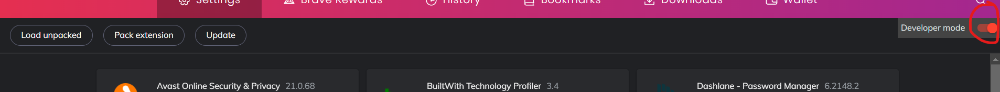
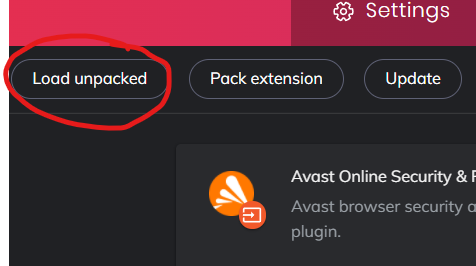

# RosettaStonks

------

### What is it ?
Rosetta Stonks is a chrome extension allowing you enhance your rosetta stone statistics.
> **RosettaStonks, and your rosetta stone goes Stonks !**

### How to install ?
1. Downloads the `rosettastonks.tar.gz` folder from the latest release.
2. in the extension menu (`<browser_name>://extensions`, e.g. `chrome://extensions`)
3. activate developper mode 

4. unzip the download file
5. click load unpacked and select the root folder of the extension

### How to use ?

Download the chrome extension, connect yourself to your 
`rosetta stone` account and complete any path question. 

It now works with both `Foundations` and `Fluency Builder` rosetta stone
products as of version `v2.0.0`.

> the extension should show `status: ready` top left

enter the number of minutes you want to add to your current time
and click `add time`

> *Note: as said on `rosetta stone` statistics page, time can take up to 24h to update.*
